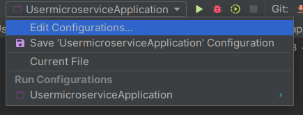
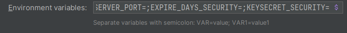
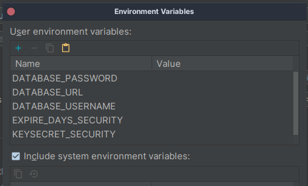

 

<h3 align="center">USER MICROSERVICE</h3>
  

  

### Built With

* 
* 
* 
* 

<!-- GETTING STARTED -->
## Getting Started

To get a local copy up and running follow these steps.

### Prerequisites

* JDK 17 [https://jdk.java.net/java-se-ri/17](https://jdk.java.net/java-se-ri/17)
* Gradle [https://gradle.org/install/](https://gradle.org/install/)
* MySQL [https://dev.mysql.com/downloads/installer/](https://dev.mysql.com/downloads/installer/)

### Recommended Tools
* IntelliJ Community [https://www.jetbrains.com/idea/download/](https://www.jetbrains.com/idea/download/)
* Postman [https://www.postman.com/downloads/](https://www.postman.com/downloads/)

### Installation

1. Clone the repository
2. Open project
3. Create a new database in MySQL called powerup-user
4. update environment variables
 
4.1. edit configurations 

 
4.2. DATABASE_URL=;DATABASE_USERNAME=;DATABASE_PASSWORD=;SERVER_PORT=;EXPIRE_DAYS_SECURITY=;KEYSECRET_SECURITY= 
 
copy this string into the "environment variables" field 

 
4.3 writes the respective values of each environment variable
 

5. After the tables are created execute src/main/resources/data.sql content to populate the database
6. Open Swagger UI and search the /auth/login endpoint and login with mail:daniela@gmail.com, password: 1234

<!-- USAGE -->
## Usage

1. Right-click the class PowerUpApplication and choose Run
2. Open [http://localhost:8090/swagger-ui/index.html](http://localhost:8090/swagger-ui/index.html) in your web browser

<!-- ROADMAP -->
## Tests

- Right-click the test folder and choose Run tests with coverage
